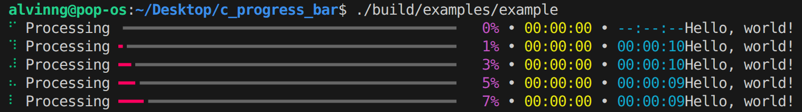

# C Progress Bar
A simple progress bar library for C.


## Features
* Beautiful progress bar
* Remaining time estimation
* Elapsed time tracking
* Works with MSVC, Clang and GCC
* Written in C99 with minimal dependencies

## Limitations
* The progress bar only prints when you call update
* If you print anything when the progress bar is running, it may be overwritten by the progress bar or appended to the end


## Sample Usage
```c
#include <stdint.h>
#include <stdio.h>
#include <stdlib.h>

#include "c_progress_bar.h"

#define N 1000000000

int main(void)
{
    double sum = 0.0;

    // Setup progress bar
    CPB_Config config = cpb_get_default_config();
    config.description = "Processing";
    CPB_ProgressBar progress_bar;
    cpb_init(&progress_bar, 0, N, config);

    // Main loop
    cpb_start(&progress_bar);
    for (int64_t i = 0; i <= N; i++)
    {
        if (i % 1000 == 0)
        {
            cpb_update(&progress_bar, i);
        }

        sum += (i % 100) * 0.0001;
    }
    cpb_finish(&progress_bar);

    printf("Final result: %f\n", sum);

    return 0;
}

```